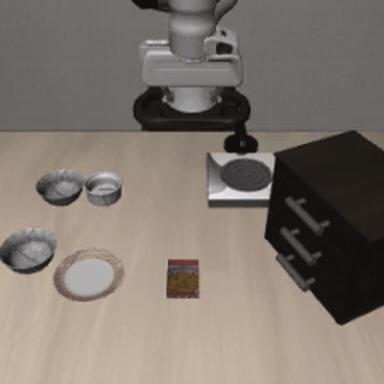
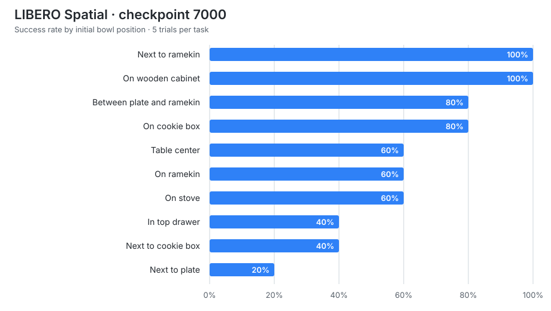

# Fine-tuning OpenPI on LIBERO with a single RTX 4090

This repository documents a low-memory LoRA fine-tuning and evaluation workflow for Physical Intelligence's π0 policy on the LIBERO Spatial benchmark.

## Highlights

- Fine-tuned `pi0_libero_low_mem_finetune` on one NVIDIA RTX 4090 (24 GB).
- Achieved **64% success (32/50)** at checkpoint 7000.
- Preserved per-task metrics and representative success/failure rollouts.
- Verified checkpoint 5000 end-to-end with a separate 10-episode smoke test.

## Demo

The policy picks up the bowl from beside the plate and completes the placement task:





## Results

| Checkpoint | Evaluation | Trials per task | Successes | Episodes | Success rate |
|---:|---|---:|---:|---:|---:|
| 7000 | Full evaluation | 5 | 32 | 50 | **64%** |
| 5000 | Smoke test | 1 | 4 | 10 | 40% |

The checkpoint-5000 result is a pipeline smoke test, not a statistically reliable head-to-head comparison. With only one rollout per task, its uncertainty is much larger than the checkpoint-7000 result.

Using a 95% Wilson interval, the checkpoint-7000 aggregate estimate is approximately **50%–76%**. The checkpoint-5000 smoke test spans approximately **17%–69%**. These overlapping intervals reinforce that the quick test cannot establish a meaningful checkpoint ranking.

Detailed reports:

- [Checkpoint 7000 evaluation](results/libero_spatial_7000.md)
- [Checkpoint 5000 quick evaluation](results/libero_spatial_5000_quick.md)
- [Qualitative failure analysis](results/failure_analysis.md)

## Checkpoint 7000 per-task results

| Initial object relation | Success rate |
|---|---:|
| Next to the ramekin | **100%** |
| On the wooden cabinet | **100%** |
| Between the plate and ramekin | 80% |
| On the cookie box | 80% |
| Table center | 60% |
| On the ramekin | 60% |
| On the stove | 60% |
| In the top drawer | 40% |
| Next to the cookie box | 40% |
| Next to the plate | 20% |

The spread from 20% to 100% shows that the policy learned the task family but remains sensitive to object placement and local scene geometry. Five trials per task expose this instability but do not provide precise task-level estimates.

## Rollout videos

- [Checkpoint 7000 success and failure examples](assets/videos/libero_spatial_7000)
- [Checkpoint 5000 smoke-test rollouts](assets/videos/libero_spatial_5000_quick_seed7)

The repository keeps only small rollout videos. Full checkpoints, datasets, Weights & Biases runs, and training caches are intentionally excluded.

## Environment

| Component | Configuration |
|---|---|
| GPU | NVIDIA GeForce RTX 4090, 24 GB |
| OS | Ubuntu 22.04 |
| Training | OpenPI JAX low-memory configuration with LoRA |
| Benchmark | LIBERO Spatial |
| Evaluation seed | 7 |
| Evaluation replan interval | 5 environment steps |
| Render backend used for the quick test | GLX |

## Evaluation workflow

The evaluation uses the upstream [OpenPI](https://github.com/Physical-Intelligence/openpi) policy server and LIBERO client. From an OpenPI checkout, start the policy server with the matching training config and checkpoint:

```bash
python scripts/serve_policy.py \
  --env LIBERO \
  policy:checkpoint \
  --policy.config pi0_libero_low_mem_finetune \
  --policy.dir /path/to/checkpoint
```

In the LIBERO environment, run the client. Use `5` trials per task for the reported checkpoint-7000 protocol, or `1` for a quick pipeline check:

```bash
export PYTHONPATH="$PWD/third_party/libero"
export MUJOCO_GL=glx
python examples/libero/main.py \
  --args.task-suite-name libero_spatial \
  --args.num-trials-per-task 5 \
  --args.video-out-path data/libero/videos \
  --args.seed 7
```

Exact environment setup and dependency instructions are maintained in OpenPI's `examples/libero/README.md`.

## Limitations

- The full result contains 50 episodes, with only five trials for each individual task.
- Checkpoint 5000 was evaluated once per task and is included only as an end-to-end smoke test.
- The runs cover LIBERO Spatial only; they do not establish performance on LIBERO Object, Goal, 10, or 90.
- Failure categories are based on visual inspection of representative rollouts rather than instrumented event labels.
- This repository records the experiment and small media artifacts but does not distribute checkpoints or training data.

## Project status

- [x] Set up OpenPI on Ubuntu 22.04
- [x] Download the LIBERO LeRobot dataset
- [x] Compute normalization statistics
- [x] Fine-tune `pi0_libero_low_mem_finetune`
- [x] Evaluate checkpoint 7000 on LIBERO Spatial
- [x] Run a checkpoint-5000 smoke test
- [x] Save success and failure rollout videos
- [x] Document task-level results and qualitative failure modes
